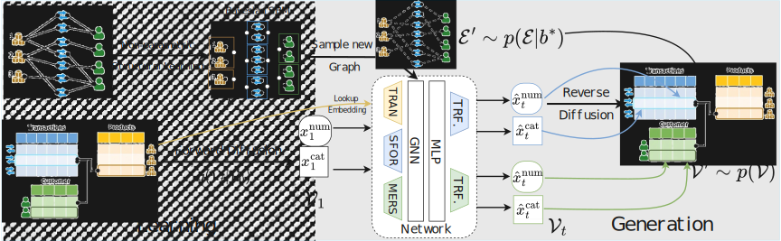

# RelDiff: Relational Data Generative Modeling with Graph-Based Diffusion Models

  
  <!--  -->
  <!--  -->

This repository provides the official implementation of the paper "RelDiff: Relational Data Generative Modeling with Graph-Based Diffusion Models".

## Latest Update

- [2025.]：Our code is at the final stage of cleaning up. Please check back soon for its release!

## Introduction

  
  
<em>Figure 1: A high-level overview of RelDiff</a></em>

RelDiff is a novel generative framework for synthesizing relational databases with arbitrarily complex schemas, achieving high fidelity and utility. Its key innovations include:

1) A principled framework for **generating foreign key structures** in relational databases, incorporating hard constraints for **referential integrity** via Bayesian stochastic block models.
2) A **joint diffusion model** for synthesizing mixed-type attributes, utilizing GNNs to capture global **inter-table dependencies**.
3) Explicitly modeling **dimension tables** as a distinct data type and defining our **diffusion model in data space**.

The schema of RelDiff is presented in the figure above. <!--  For more details, please refer to [our paper](). -->

